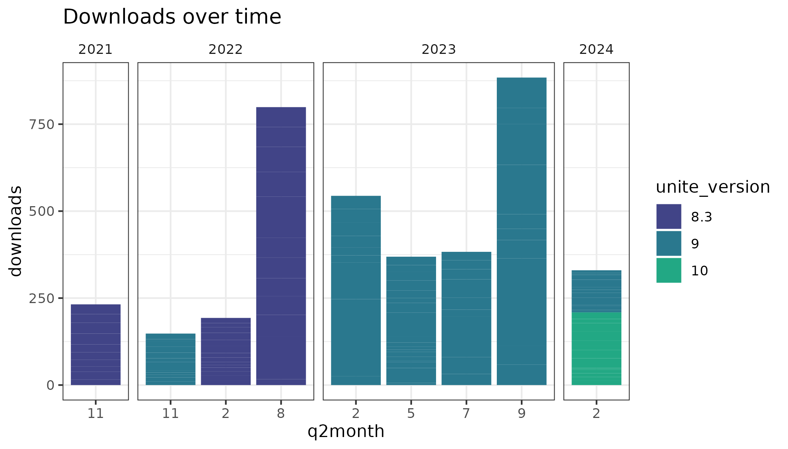
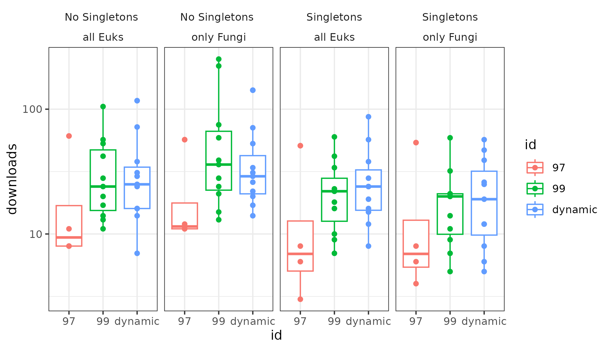

# unite-train

A pipeline to build [Qiime2](https://qiime2.org/) taxonomy [classifiers](https://docs.qiime2.org/2021.11/data-resources/) for the [UNITE database](https://unite.ut.ee/repository.php).

## [Download a pre-trained classifier here! 🎁](https://github.com/colinbrislawn/unite-train/releases)

[](https://github.com/colinbrislawn/unite-train/issues)

[](https://github.com/colinbrislawn/unite-train/releases)

### What is this?

If you are interested in Fungi 🍄🍄‍🟫 you could use their genomic fingerprint to identify them. Affordable PCR amplification and sequencing of the ITS gene gives you these nucleic acid fingerprints, and the UNITE team provides a database to gives these sequences a name.

We can predict the taxonomy of our fungal fingerprints using an old-school machine learning method: a supervised [k-mer](https://en.wikipedia.org/wiki/K-mer) [nb-classifier](https://scikit-learn.org/stable/modules/naive_bayes.html). But first, we need to prepare our database in a process called 'training.'

This is a pipeline that trains the UNITE ITS taxonomy database for use with Qiime2. You can run this pipeline yourself, but you don't have to! I've provided a [ready to use pre-trained classifiers](https://github.com/colinbrislawn/unite-train/releases) so you can simply run [`qiime feature-classifier classify-sklearn`](https://docs.qiime2.org/2024.2/plugins/available/feature-classifier/classify-sklearn/).

If you have questions about using Qiime2, ask on [the Qiime2 forums](https://forum.qiime2.org/).

If you have questions about the UNITE ITS database, [contact the UNITE team](https://unite.ut.ee/contact.php).

If you have questions about this pipeline, please [open a new issue](https://github.com/colinbrislawn/unite-train/issues/new)!

---

## Running Nextflow Workflow

Set up:

- Install [qiime2-amplicon with conda](https://library.qiime2.org/quickstart/amplicon)
- Install [Nextflow with conda](https://www.nextflow.io/docs/latest/install.html#conda)

Configure & Run:

```sh
# edit config as needed (update path to qiime2 conda env)
open nextflow.config

# Run nextflow: All save report to ./results/
export NXF_OFFLINE=TRUE
nextflow run main.nf -resume
```

## Downloads




