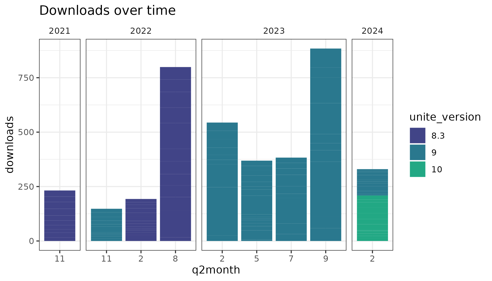
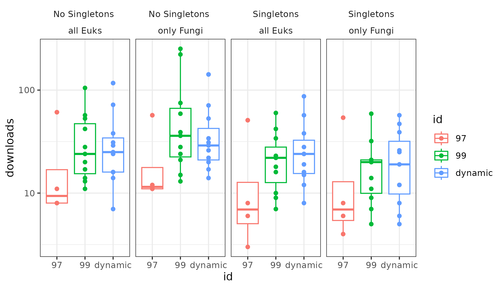

# unite-train

A pipeline to build [Qiime2](https://qiime2.org/) taxonomy [classifiers](https://library.qiime2.org/data-resources) for the [UNITE database](https://unite.ut.ee/repository.php).

## [Download a pre-trained classifier here! 🎁](https://github.com/colinbrislawn/unite-train/releases)

[](https://github.com/colinbrislawn/unite-train/issues)
[](https://github.com/colinbrislawn/unite-train/releases)
[](https://github.com/colinbrislawn/unite-train/releases)

### What is this?

If you are interested in Fungi 🍄 you could use their genomic fingerprint 🧬 to identify them. Affordable PCR amplification and sequencing of the ITS gene gives you these nucleic acid fingerprints, and the UNITE team provides a database to gives these sequences a name.

We can predict the taxonomy of our fungal fingerprints using an old-school machine learning method: a supervised [k-mer](https://en.wikipedia.org/wiki/K-mer) [nb-classifier](https://scikit-learn.org/stable/modules/naive_bayes.html). But first, we need to prepare our database in a process called 'training.'

This is a pipeline that trains the UNITE ITS taxonomy database for use with Qiime2. You can run this pipeline yourself, but you don't have to! I've provided a [ready to use pre-trained classifiers](https://github.com/colinbrislawn/unite-train/releases) so you can simply run [`qiime feature-classifier classify-sklearn`](https://amplicon-docs.qiime2.org/en/stable/references/plugins/feature-classifier.html).

If you have questions about using Qiime2, ask on [the Qiime2 forums](https://forum.qiime2.org/).

If you have questions about the UNITE ITS database, [contact the UNITE team](https://unite.ut.ee/contact.php).

If you have questions about this pipeline, please [open a new issue](https://github.com/colinbrislawn/unite-train/issues/new)!

---

## Running Nextflow Workflow

Set up:

⚠️ Pixi is still new to me! I am testing this out!

- Install [Pixi](https://pixi.prefix.dev/latest/installation/)

Install Nextflow into the global env

```sh
pixi global install  -c conda-forge -c bioconda nextflow openjdk=17
```

Here's the cool part; we can install the locked version of Qiime I commited to the repo! It's in the code!

```sh
pixi install
```

Use Pixi to install the newest version of Qiime2. Use [this yaml file](https://library.qiime2.org/quickstart/qiime2#id-3-install-the-base-distributions-conda-environment).

```sh
# Reset pixi
rm pixi.toml pixi.lock
rm -rf .pixi/

# Get new qiime distribution
wget https://raw.githubusercontent.com/qiime2/distributions/refs/heads/dev/2026.4/qiime2/released/rachis-qiime2-osx-64-conda.yml
# New pixi
pixi init --platform osx-64 --import rachis-qiime2-osx-64-conda.yml

# Test (and also refresh the cache)
pixi run qiime info

# Add it directly to the repo?
git add pixi*
```

## Configure & Run:

```sh
# Reports, timeline and trace save to ./results/
export NXF_OFFLINE=TRUE
nextflow run main.nf -resume
```

## Downloads




